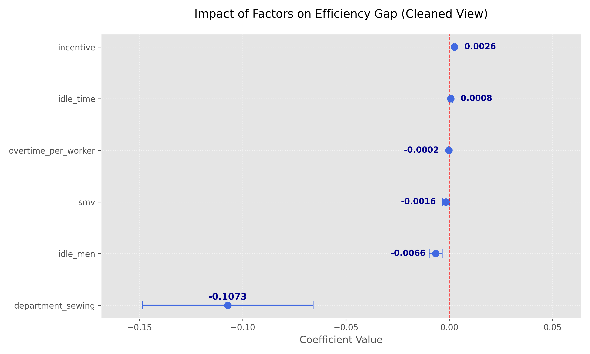

# 成衣生產效率診斷與瓶頸分析 （Garment Production Efficiency Diagnosis & Bottleneck Analysis）

### 專案背景與業務問題 (Project Overview)
在製造管理中，單純的產出數據往往無法揭示「效率流失」的根因。本專案透過分析成衣廠 12 個團隊的生產數據，旨在解決以下核心問題：
- **識別異常**：從大量數據中快速鎖定績效落後的生產線（Team）。
- **量化風險**：驗證「閒置人力 (Idle Men)」與「標準工時 (Standard Minute Value)」對排程進度的實質影響。
- **資源優化**：提供管理層預警指標，協助優化人力配置以縮減效率缺口 (Efficiency Gap)。

### 技術亮點 (Technical Workflow)
- **SQL資料預處理**：
  - **格式統一**：使用 STR_TO_DATE 修正不一致的日期格式。
  - **拼字校正**：修正Department中 sweing -> sewing、處理 finishing_ 多於空格，確保後續Grouping分析準確性
  - **特徵工程**：定義Efficiency Gap = Actual Productivity - Targeted Productivity等KPI，作為核心監控指標。
    
- **數據分析與自動化視覺化** (Python - Pandas, Seaborn)：
  - **效率矩陣 (Heatmap)**：開發自動化排序邏輯，結合視覺心理學（RdYlGn 配色）快速定位 Team 10 的極端負值區域（-0.24）。
  - **趨勢分析**：結合 Bar Chart 追蹤全廠週期性波動，發現第 8、9 週的集體效率下滑。
  - **回歸統計驗證 (OLS Regression)**：使用 statsmodels 進行顯著性檢定，證實 idle_men 與效率下降呈高度負相關 ($p < 0.05$)，以及縫紉部門為主要產能缺口較大的部門。

    

### 關鍵洞察與行動建議 (Insights & Action)
- **異常診斷Team 10** ：在 Week：201508 的暴跌可能與兩筆資料中皆有 Idle_men 激增至35人有關，詳細內容可能還需要去現場了解狀況。
- **全廠趨勢（Week 8,9）**：各組生產力集體下滑與 Idle Men 閒置工人約有 60% 發生在該週呈高度相關。
- **標竿學習（Team 1,3）**：此兩組長期保持零閒置人力且高效率，建議深入訪談該組組長之排程邏輯與物料準備流程，轉化為標準化作業規範。
- **排成優化**：建議可以針對閒置工人的配置來建立一個模型來避開人力閒置的高峰以優化排程。
- **現場了解**：針對如Team 10 第8週效率暴跌、Team 6,7,8 整體效率差距較大等，生管可介入現場詳細了解產線狀況與原因並協調人力。
- **部門優化（sewing）**：縫紉部門代表了主要的結構性瓶頸。分析顯示，其先天效率缺口比後整部（finishing）高出 10.7%，這意味著全廠效率提升的最關鍵機會在於優化縫紉線的工作流程。
